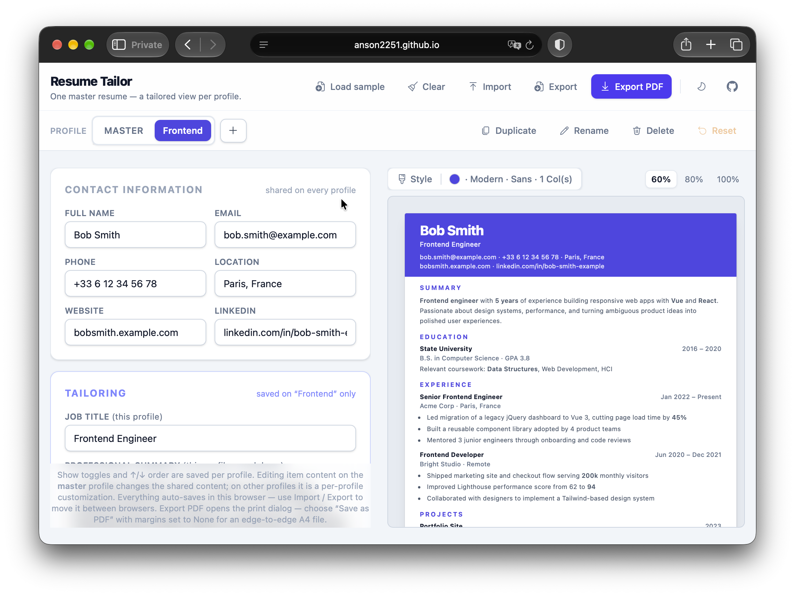

# Resume Tailor

> **One master resume — a tailored view per profile.**
> Stop copying your resume for every application. Keep one source of truth, then tailor what each role sees.

**[✨ Try the live demo →](https://anson2251.github.io/resume-tailor/)**



Built with Vue 3 + Tailwind CSS v4 + Vite. Your data never leaves your browser.

---

## Why Resume Tailor?

Applying to a Frontend role and a Product Engineer role with the same resume undersells you — but maintaining `resume-frontend-v7-final.pdf`, `resume-react-2024.pdf`, … means your edits drift out of sync.

Resume Tailor fixes that:

1. **Build one master resume** — all your experience, projects, education, skills, and contact info in one place.
2. **Create a profile per target role** — each profile saves its own _view_: which items are shown, in what order, plus its own job title, summary, template, accent color, and font.
3. **Preview live & export PDF** — see an A4 page update as you type, then print to a crisp, selectable-text PDF.

No accounts, no uploads, no duplicated content.

## Features

### 🎯 Tailor without duplicating

- **One master, many profiles.** Content (experience, projects, education, skills, contact) is shared. Each **profile** is a tailored view over it — perfect for targeting several roles from the same master.
- **Edit the master, or tailor a profile.** The profile marked **master** (tagged in the bar) edits the shared content directly — those edits change what every profile inherits. On any other profile, editing a field saves a **per-profile content override** instead. Overridden items are flagged and can be reverted individually (“Use master”) or all at once (“Reset”). Editing a field back to the master value drops the override automatically.
- **Profile bar** in the header: switch between profiles (as accent-colored tabs, or a select once there are more than five), plus create, duplicate, rename, and delete profiles.

### ✍️ Editing that mirrors the resume

- **Form mirrors the resume**: contact info, experience, projects, education, and skills sections — the Tailoring card and section cards follow the profile's section order (Sections panel), so the form reads in the same order as the preview.
- **Repeatable fields are editable lists**: each experience / project / education / skill-group entry is a card you can **drag by its grip handle to reorder**, or nudge with the ↑/↓ buttons, add, remove, and show/hide. Shown items come first (in the profile's order); items hidden from the current profile stay editable below, greyed out. Removing an entry deletes it from the master and from every profile.
- **Markdown for long-form text**: the professional summary, experience achievements, project highlights, and education details render as **markdown** via `vue-markdown-render` (markdown-it) — write `-` bullets, `**bold**`, `*italic*`, `[links](https://…)`, `` `code` ``. Raw HTML is escaped and dangerous link protocols are blocked.

### 👀 Live preview & export

- **Live preview** with 3 templates: **Modern, Classic, Minimal** — plus a **1 / 2 column** layout toggle and a **Style popover** for the accent color and body font (all saved per profile). The font defaults to the template's own font (Modern/Minimal → Sans, Classic → Serif) until you pick one. Two columns makes the body content (summary, experience, projects, education, skills) flow newspaper-style across two columns; entries stay whole and headings stay with their content.
- **Sections panel** — reorder the resume sections (drag by the grip handle or nudge with ↑/↓), rename any heading per profile (empty = template default), show/hide whole sections, and flip any repeatable list between column and row flow with the grid button (row lays entries out in a two-column grid). Saved per profile, so e.g. a graduate profile can lead with Education while an industry profile leads with Experience. **Add section** creates your own (Certifications, Languages, …) with generic heading/subtitle/dates/details items; user-created sections get a delete button that removes them from the master and every profile. Built-in sections can't be deleted — hide them instead.
- **Export PDF button** — opens the print dialog; choose “Save as PDF” with margins set to None for an edge-to-edge A4 file with selectable vector text.

### 💾 Private by design

- The whole workspace **auto-saves to localStorage**; **Load sample** / **Clear** helpers in the top bar.
- **Import / Export buttons** — move your workspace (master + all profiles) between browsers as a minified JSON file. Import also accepts older single-resume files, which are migrated into a profile, and asks before replacing your current content.
- **Light / dark workspace** toggle in the top bar (persisted, follows the OS setting until you pick one) — the resume page itself always stays light so the printout never changes. The GitHub icon next to it links to the repo.

## Run it

```sh
pnpm install
pnpm dev      # dev server
pnpm build    # production build → dist/
pnpm preview  # preview the build
pnpm format   # format everything with Prettier
```

---

## For developers

### Project layout

```
index.html
src/
  main.js                 # app entry
  style.css               # tailwind + shared form classes + print CSS
  App.vue                 # top bar, workspace state, profile actions, form/preview layout
  data/
    resume.js             # master content shape, blank/sample factories, parsing helpers
    workspace.js          # profiles (views + overrides), migration from old saves, preview builder
    options.js            # templates, accent & font lists
    icons.js              # per-icon ESM re-exports (from @vicons/fluent)
  components/
    MarkdownText.vue      # markdown renderer (vue-markdown-render + shared options)
    Popover.vue           # generic slot-driven popover (trigger + content slots)
    ProfileBar.vue        # profile switcher + new/duplicate/rename/delete + clear customizations
    ResumeForm.vue        # the editing form (copy-on-write content fields)
    RepeatableList.vue    # shared list chrome: drag/reorder, show, remove, add, override badge
    ResumePreview.vue     # A4 page wrapper, picks the active template, Style popover
    templates/
      ModernTemplate.vue  # accent header, 1/2-column body
      ClassicTemplate.vue # centered serif, single column
      MinimalTemplate.vue # airy, hairline dividers
```

### Data model

The app keeps a single workspace, persisted as `{ version, master, profiles, activeProfileId }`:

- **`master`** holds the shared content (items keyed by `id`); it has no visibility or order of its own. `master.customSections` holds user-created sections as `[{ id, title, items }]` with generic `{ id, heading, sub, dates, body }` items.
- Each **profile** is a view over the master:
  - `master` — `true` for the one profile that edits the shared content directly. Exactly one profile is the master (the flagged one, else the first); any overrides it still carried are folded into the shared content on load.
  - `view: { experience: [id, …], projects: […], education: […], skills: […], custom: { [sectionId]: [id, …] } }` — an ordered list of the ids **shown** on that profile (array order = display order; ids not listed are hidden). User-created sections keep their own id lists under `view.custom`.
  - `overrides: { [itemId]: { field: value, … } }` — copy-on-write per-item field overrides (e.g. rewritten bullets). Applied on top of the master item when rendering.
  - `title` / `summary` — the tailoring fields for that target role.
  - `template` / `accent` / `font` — presentation, saved per profile. `font` is `null` by default, meaning “use the template's font”; pick a font in the Style popover to pin one explicitly.
  - `columns` — `1` (single column) or `2` (body flows across two columns).
  - `sections` — ordered `[{ id, title, visible, direction }]` over `summary`, the four repeatable sections, and any user-created sections (appended after the built-ins). `title` is a per-profile heading override (empty = template default, or the master name for custom sections); `visible` hides the whole section on that profile; `direction` is `col` (vertical stack) or `row` (two-column grid of entries).

The preview is derived by resolving the active profile's view into the resume shape the templates consume, so templates never deal with profiles directly.

Older saves (`{ resume, template, accent }`) and bare resume JSON are migrated on load/import into a single “Master” profile, preserving which items were visible.

### Notes

- Long-form fields (summary, achievements, highlights, details) are **markdown** — the old “one line = one bullet” convention is gone; write `- ` for bullets. Skill inputs are still **comma-separated**. Markdown is rendered by `MarkdownText.vue` with `{ html: false, linkify: true, breaks: true }`: `html: false` escapes raw HTML, `linkify` auto-links bare URLs, and `breaks` keeps single newlines readable so content written before markdown still reads well.
- Per-template markdown styling lives in `style.css` under `.md` (and `.md-dot` for the Minimal template's accent dots); it is unlayered so it overrides Tailwind Preflight, which strips list styles. The rhythm is deliberately tight: **no margins inside `.md` by default**, with a small gap only between _adjacent top-level blocks_ (`0.4em`) and between list items (`0.2em`). That keeps a single paragraph/list exactly as tight as plain text, and keeps “loose” markdown lists (items separated by blank lines, which markdown-it wraps in `<p>`) from ballooning — so the sample still fits one A4 page in all three templates.
- The **1/2 column** toggle is plain CSS multi-column (`.resume-columns`: `column-count: 2`) on each template's body wrapper — the sections/entries flow across the columns rather than a fixed sidebar. Entries (`.avoid-break`) don't split mid-item and headings use `break-after: avoid`, so a heading never ends up stranded at the bottom of a column. All the spacing that must survive a break — between sections (`pt-*` on each `<section>`) and between entries (`.entry-stack` / `-sm` / `-xs`) — is **padding, not margin**: margins are truncated when a box starts a new column/page fragment, which would otherwise leave a heading or an entry flush against the top of column 2 or page 2.
- PDF export is print-based: no extra dependencies, crisp vector text, and the `@page` rule targets A4 with zero margins. The print stylesheet flattens the app chrome so only the 210mm resume page lands on the sheet.
- A profile's _view_ only stores ids and item content lives once in the master; _overrides_ store only the fields that differ. Removing an item drops it from the master and from every profile's view and overrides, so no dangling ids are saved.
- On a tailoring profile, edits are copy-on-write, so changing an item there won't update the shared content. To change the shared wording, switch to the **master** profile (or reset the override first).
- Custom layouts are intentionally out of scope for now — to add one, create a new component in `src/components/templates/` and register it in `ResumePreview.vue` + the `TEMPLATES` list in `data/options.js`. Templates receive `columns` (1 or 2) and apply the `.resume-columns` helper class to their body wrapper; the multi-column CSS lives in `style.css`. They also receive a resolved `font` id and apply it via `fontStack(font)` (from `data/options.js`).
- Icons are **Fluent icons** via `@vicons/fluent`, wrapped with `Icon` from `@vicons/utils`. Add new ones to `src/data/icons.js` (per-icon ESM imports keep the bundle and the dev optimizer small) and reference them by name in components.
