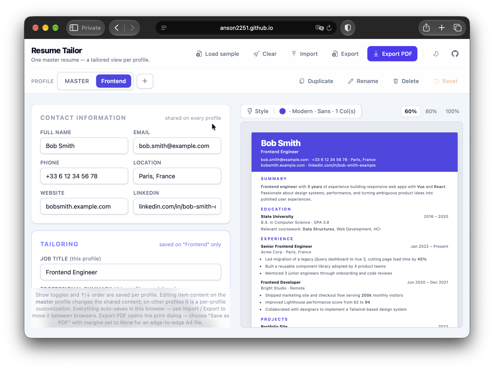

# Resume Tailor

A simple resume-tailoring tool

> **One master resume — a tailored view per job.**
> Stop copying your resume for every application. Keep one source of truth, then let Mira — the built-in LLM agent — tailor each job fast.

**[✨ Try the live demo →](https://anson2251.github.io/resume-tailor/)**



Built with Vue 3 + TypeScript + Tailwind CSS v4 + Vite, on web and as an Electron desktop app. Your workspace stays on your device — nothing leaves it except agent requests to the AI provider you configure.

---

## Why Resume Tailor?

Applying to a Frontend role and a Product Engineer role with the same resume undersells you — but maintaining `resume-frontend-v7-final.pdf`, `resume-react-2024.pdf`, … means your edits drift out of sync.

Resume Tailor fixes that:

1. **Build one master resume** — all your experience, projects, education, skills, and contact info in one place.
2. **Create a job per target role** — each job saves its own _view_: which items are shown, in what order, plus its own job title, summary, cover letter, template, accent color, and font.
3. **Let Mira tailor it fast** — attach the job description and the LLM agent drafts bullet rewrites, title/summary, and a cover letter for that job, asking for evidence instead of inventing it.
4. **Preview live & export PDF** — see an A4 page update as you type, then print to a crisp, selectable-text PDF.

No accounts, no duplicated content — and your workspace stays local except for agent requests you trigger.

## Features

### 🎯 Tailor without duplicating

- **One master, many jobs.** Content (experience, projects, education, skills, contact) is shared. Each **job** is a tailored view over it — perfect for targeting several roles from the same master.
- **Edit the master, or tailor a job.** The **Master** profile (pinned in the rail) edits the shared content directly — those edits change what every job inherits. On any other job, editing a field saves a **per-job content override** instead. Overridden items are flagged and can be reverted individually (“Use master”) or all at once (“Reset”). Editing a field back to the master value drops the override automatically.
- **Job rail** on the side: Master pinned on top plus one row per job (`company — role`, status dot), with text filter, plus create, duplicate, rename, and delete jobs.

### ✍️ Editing that mirrors the resume

- **Form mirrors the resume**: contact info, experience, projects, education, and skills sections — the Tailoring card and section cards follow the job's section order (Sections panel), so the form reads in the same order as the preview.
- **Repeatable fields are editable lists**: each experience / project / education / skill-group entry is a card you can **drag by its grip handle to reorder**, or nudge with the ↑/↓ buttons, add, remove, and show/hide. Shown items come first (in the job's order); items hidden from the current job stay editable below, greyed out. Removing an entry deletes it from the master and from every job.
- **Markdown for long-form text**: the professional summary, experience achievements, project highlights, and education details render as **markdown** via `vue-markdown-render` (markdown-it) — write `-` bullets, `**bold**`, `*italic*`, `[links](https://…)`, `` `code` ``. Raw HTML is escaped and dangerous link protocols are blocked.

### 👀 Live preview & export

- **Live preview** with 3 templates: **Modern, Classic, Minimal** — plus a **1 / 2 column** layout toggle and a **Style popover** for the accent color and body font (all saved per job). The font defaults to the template's own font (Modern/Minimal → Sans, Classic → Serif) until you pick one. Two columns makes the body content (summary, experience, projects, education, skills) flow newspaper-style across two columns; entries stay whole and headings stay with their content.
- **Sections panel** — reorder the resume sections (drag by the grip handle or nudge with ↑/↓), rename any heading per job (empty = template default), show/hide whole sections, and flip any repeatable list between column and row flow with the grid button (row lays entries out in a two-column grid). Saved per job, so e.g. a graduate job can lead with Education while an industry job leads with Experience. **Add section** creates your own (Certifications, Languages, …) with generic heading/subtitle/dates/details items; user-created sections get a delete button that removes them from the master and every job. Built-in sections can't be deleted — hide them instead.
- **Export PDF button** — opens the print dialog; choose “Save as PDF” with margins set to None for an edge-to-edge A4 file with selectable vector text. The desktop app saves the PDF file directly instead.

### 🤖 Mira — agent-assisted tailoring

- **Per-job chat.** Each job has its own threaded conversations with Mira: send, stop, retry, regenerate any reply, edit-and-resend, and switch branches — the thread is saved with the job.
- **Attach the JD once.** Drop the posting PDF into the JD pane; Mira reads the extracted text and grounds every suggestion in it. No JD attached → she says so and gives only generic help.
- **She edits through tools, not guesses.** Bullet rewrites, title/summary, cover-letter body and fields, and visibility changes land as the same overrides you'd make by hand — with a confirm step before hiding a lot at once. Reads and coaching stay available on Master; tailoring writes refuse there and point you at a job.
- **Guided by manuals.** Mira pulls in focused guidance on demand: cover-letter craft, the app's own mechanics, and brainstorming when your resume is thin.
- **Honest by design.** She asks for true facts before drafting, never invents employers, metrics, or skills, mirrors the posting's language, and flags JD requirements you don't yet meet. See [Fair use](#fair-use).
- **Bring your own key.** Pick any provider/model you've enabled in Settings; keys live in the OS keychain on desktop (session memory on web) and never in your workspace file.

### 💾 Private by design

- The whole workspace **auto-saves locally** — IndexedDB on web, SQLite in the
  desktop app; **Load sample** / **Clear** helpers in the top bar. API keys are
  never in the workspace file: OS keychain on desktop, session memory on web.
- **Import / Export buttons** — move your workspace (master + all profiles) between browsers as a minified JSON file. Import also accepts older single-resume files, which are migrated into a profile, and asks before replacing your current content.
- **Light / dark workspace** toggle in the top bar (persisted, follows the OS setting until you pick one) — the resume page itself always stays light so the printout never changes. The GitHub icon next to it links to the repo.


## Fair use

> [!important] 
> Resume Tailor helps you present your real experience in the best light for each role — not to invent a different one. By using this software you agree:
> 
> 1. **Everything you export is true** — real employers, dates, degrees, skills, and outcomes you can defend in an interview.
> 2. **You won't fabricate through this tool** — no invented experience, inflated metrics, or implied expertise you don't hold, including stuffing a posting's vocabulary into skills you lack. This covers asking Mira to generate such content as well as typing it in yourself.
> 3. **You understand why** — a job won with invented lines is a job you are not suited for and will struggle in, and each such offer is one a genuinely suitable candidate loses. Employers who discover dishonesty rescind offers and terminate hires.
> 4. **The sample workspace (Bob Smith) is placeholder data** — replace it with your own history before applying anywhere.
> 5. **Check your institution's GenAI policy first.** Many universities and employers restrict AI use in applications. If yours bans it, do not use Mira's agent features. Where AI use is allowed, use it fairly: Mira can advise and speed up tailoring, but it can also hallucinate — verify every suggestion against your real history, keep your own ideas central, and never let it write claims you can't personally vouch for. You own every line you submit.
> 
> Mira is designed to ask for evidence rather than guess, and to flag gaps you don't yet meet — please don't work around that. This statement governs use of the app; the code itself remains under the MIT license, free to copy, modify, and distribute. Your data stays on your device — nothing is sent anywhere except to the AI provider you configure, when you use the agent.

## Run it

```sh
pnpm install
pnpm dev        # dev server
pnpm build      # typecheck (vue-tsc) + production build → dist/
pnpm typecheck  # vue-tsc only, no emit
pnpm preview    # preview the build
pnpm format     # format everything with Prettier
```

## Desktop app (Electron)

The same UI ships as a desktop app. Both platforms share a unified store —
SQLite on desktop, IndexedDB on web — holding the workspace, settings, and JD
PDF bytes; API keys live in the OS keychain on desktop (session memory on web).
A splash screen covers both the native window boot and the
in-app workspace load, so the window is never blank during initialization.

```sh
pnpm electron:dev    # Vite dev server + Electron (with HMR)
pnpm electron:start  # run Electron against the last vite build
pnpm dist            # package for the current OS → release/
pnpm dist:mac | pnpm dist:win | pnpm dist:linux
```

How it works:

- `electron/main.ts` + `electron/preload.ts` — main process and bridge,
  compiled with `tsc -p tsconfig.electron.json` (`pnpm build:electron`) into
  `electron/dist/` (CommonJS + a nested `package.json`, since the repo root
  is `"type": "module"`). The main process owns the native splash window,
  the main window (shown only after the renderer signals first paint, with
  an 8s fallback), the `resume-tailor:store-*` IPC handlers that read/write
  the JSON file, and the `resume-tailor:export-pdf` handler (save dialog +
  `webContents.printToPDF`, reusing the same print CSS as the web flow).
- **Single title bar**: the native title text is hidden (`hiddenInset` on
  macOS, `hidden` + window-controls overlay on Windows/Linux) so it never
  duplicates the app header — the header keeps a 36px top strip housing the
  OS controls that also serves as the drag handle, the overlay colors follow
  the app theme, and the strip collapses in fullscreen (where the OS hides
  its controls).
- `electron/preload.ts` — minimal `window.electronAPI` bridge
  (store, keyring, JD bytes, `notifyReady`); no Node access in the renderer.
- `electron/db.ts` — SQLite store + one-time legacy migration (main process).
- `electron/splash.html` — static native splash (no bundle needed).
- `src/data/persistence.ts` + `src/data/store/` — unified workspace/settings/JD-byte
  store (SQLite on desktop, IndexedDB on web) + ready signal; first run adopts
  an existing older save. Writes from the app are debounced (300ms).
- `src/components/AppSplash.vue` + the `#boot-splash` placeholder in
  `index.html` — in-app loading state until the workspace file is read.
- **Export PDF** in the desktop app skips the print dialog: it asks where to
  save, renders the resume page with `printToPDF` (A4, zero margins,
  backgrounds on — identical output to the web flow), and offers to reveal
  the file afterwards. On the web it still uses the print dialog.

---

## For developers

### Project layout

```
index.html
electron/
  main.ts                 # main process: splash + main windows, app-data JSON store
  preload.ts              # window.electronAPI bridge (store.load/save, notifyReady)
  db.ts                   # SQLite store + legacy migration (main process)
  splash.html             # static native splash screen
  sync-dist-meta.mjs      # stamps electron/dist/package.json (CommonJS) on build
src/
  main.ts                 # app entry
  style.css               # tailwind + shared form classes + print CSS
  App.vue                 # top bar, workspace state, job actions, pane layout
  electron-api.d.ts       # window.electronAPI bridge types
  agent/                  # Mira: system prompt, tools, chat, manuals, models, JD, keyring
    agentSettings.ts      # locked core prompt + manual index + user extras
    tools.ts              # job-scoped tools (read/resume, JD, rewrites, letter, visibility, manual)
    useAgentChat.ts       # streaming run loop bound to one job's thread
    manuals.ts            # manual registry (?raw) + preinjected name/description index
    manuals/              # cover-letter.md, resume-tailor.md, skill-brainstorm.md
    models.ts             # pi-ai provider catalog + per-model context budgets
    threads.ts            # wisp-style branched chat threads
    conversations.ts      # per-job conversation list
    jd.ts                 # JD PDF byte store (IndexedDB / app-data) + text extract
    keyring.ts            # API keys: OS keychain (desktop) / session memory (web)
    providerSettings.ts   # enabled models + custom providers/models
    panes.ts              # dual-pane view resolution
  data/
    types.ts              # shared domain model (master, job, workspace, letter)
    resume.ts             # master content shape, blank/sample factories, parsing helpers
    workspace.ts          # jobs (views + overrides), migration from old saves, preview builder
    letter.ts             # structured cover-letter defaults
    transfer.ts           # export/import (zip + JSON)
    persistence.ts        # unified store (IndexedDB web / SQLite desktop) + ready signal
    dialogs.ts            # promise-based confirm/prompt/notify queue (+markdown bodies)
    fairUse.ts            # first-run fair-use notice text
    options.ts            # templates, accent & font lists
    icons.ts              # per-icon ESM re-exports (from @vicons/fluent)
    store/                # settings doc + web legacy migration
  libs/
    mdast-to-vnode.ts     # markdown → Vue VNodes (remark + GFM)
  components/
    AppSplash.vue         # in-app loading state while the workspace file is read
    JobList.vue           # job rail: Master pinned + jobs + new/duplicate/rename/delete
    AgentPanel.vue        # Mira chat: JD header, thread + siblings, composer, tool cards
    JDViewer.vue          # attached JD PDF viewer
    CoverLetterForm.vue   # structured letter fields (recipient, Re line, body, sign-off, date)
    LetterPreview.vue     # A4 letter preview with independent style popover
    ResumeForm.vue        # the editing form (copy-on-write content fields)
    RepeatableList.vue    # shared list chrome: drag/reorder, show, remove, add, override badge
    ResumePreview.vue     # A4 page wrapper, picks the active template, Style popover
    FormNav.vue           # section navigator following the form pane
    SettingsPage.vue      # providers/keys, model picker, agent behavior
    DialogHost.vue        # confirm/prompt/notify renderer (incl. first-run fair use)
    StreamMarkdown.vue    # streaming markdown renderer (chat bubbles)
    MarkdownText.vue      # static markdown renderer
    Popover.vue           # generic slot-driven popover (trigger + content slots)
    AutoScrollWrapper.vue # stick-to-bottom scroller for the chat thread
    templates/
      ModernTemplate.vue  # accent header, 1/2-column body
      ClassicTemplate.vue # centered serif, single column
      MinimalTemplate.vue # airy, hairline dividers
```

### Data model

The app keeps a single workspace, persisted as `{ version, master, jobs, activeJobId }`:

- **`master`** holds the shared content (items keyed by `id`); it has no visibility or order of its own. `master.customSections` holds user-created sections as `[{ id, title, items }]` with generic `{ id, heading, sub, dates, body }` items.
- Each **job** (`Job extends Profile`) is a view over the master:
  - `kind: 'master' | 'job'` — exactly one job is the master: it edits the shared content directly and holds no JD, title, or summary.
  - `view: { experience: [id, …], projects: […], education: […], skills: […], custom: { [sectionId]: [id, …] } }` — an ordered list of the ids **shown** on that job (array order = display order; ids not listed are hidden). User-created sections keep their own id lists under `view.custom`.
  - `overrides: { [itemId]: { field: value, … } }` — copy-on-write per-item field overrides (e.g. rewritten bullets). Applied on top of the master item when rendering.
  - `title` / `summary` — the tailoring fields for that target role.
  - `company` / `jobTitleTarget` / `jobDescription` / `jobUrl` / `jdSource` — the attached posting (JD text is readonly, replaced only by re-attaching the PDF; bytes live outside the workspace JSON).
  - `letter: { recipientTitle, recipientAddress, jobTitle, postingNumber, showReLine, body, signoff, dateMode, dateCustom, credentialLine }` — the structured cover letter, plus independent `letterTemplate` / `letterAccent` / `letterFont` / `letterDensity` styling.
  - `conversations: Conversation[]` + `activeConversationId` — Mira's per-job chat threads (branched, retryable).
  - `template` / `accent` / `font` — presentation, saved per job. `font` is `null` by default, meaning “use the template's font”; pick a font in the Style popover to pin one explicitly.
  - `columns` — `1` (single column) or `2` (body flows across two columns).
  - `sections` — ordered `[{ id, title, visible, direction }]` over `summary`, the four repeatable sections, and any user-created sections (appended after the built-ins). `title` is a per-job heading override (empty = template default, or the master name for custom sections); `visible` hides the whole section on that job; `direction` is `col` (vertical stack) or `row` (two-column grid of entries).

The preview is derived by resolving the active job's view into the resume shape the templates consume, so templates never deal with jobs directly. Settings (theme, agent behavior, enabled models, custom providers, fair-use ack) persist separately in a `{ version, theme, agent, providers, fairUseAcknowledged }` doc.

Older saves (`{ resume, template, accent }` and v2 `{ profiles, activeProfileId }`) are migrated on load/import into v3 jobs, preserving which items were visible.

### Notes

- The codebase is strict TypeScript (`pnpm typecheck`, part of `pnpm build`).
  The domain model lives in `src/data/types.ts`; raw persisted JSON stays
  `unknown`/`any` at the normalization boundary (`workspace.ts`) and comes
  out fully typed. Renderer imports are extensionless (`.js` suffixes don't
  resolve to `.ts` under Vite).

- Long-form fields (summary, achievements, highlights, details) are **markdown** — the old “one line = one bullet” convention is gone; write `- ` for bullets. Skill inputs are still **comma-separated**. Markdown is rendered by `MarkdownText.vue` with `{ html: false, linkify: true, breaks: true }`: `html: false` escapes raw HTML, `linkify` auto-links bare URLs, and `breaks` keeps single newlines readable so content written before markdown still reads well.
- Per-template markdown styling lives in `style.css` under `.md` (and `.md-dot` for the Minimal template's accent dots); it is unlayered so it overrides Tailwind Preflight, which strips list styles. The rhythm is deliberately tight: **no margins inside `.md` by default**, with a small gap only between _adjacent top-level blocks_ (`0.4em`) and between list items (`0.2em`). That keeps a single paragraph/list exactly as tight as plain text, and keeps “loose” markdown lists (items separated by blank lines, which markdown-it wraps in `<p>`) from ballooning — so the sample still fits one A4 page in all three templates.
- The **1/2 column** toggle is plain CSS multi-column (`.resume-columns`: `column-count: 2`) on each template's body wrapper — the sections/entries flow across the columns rather than a fixed sidebar. Entries (`.avoid-break`) don't split mid-item and headings use `break-after: avoid`, so a heading never ends up stranded at the bottom of a column. All the spacing that must survive a break — between sections (`pt-*` on each `<section>`) and between entries (`.entry-stack` / `-sm` / `-xs`) — is **padding, not margin**: margins are truncated when a box starts a new column/page fragment, which would otherwise leave a heading or an entry flush against the top of column 2 or page 2.
- PDF export is print-based: no extra dependencies, crisp vector text, and the `@page` rule targets A4 with zero margins. The print stylesheet flattens the app chrome so only the 210mm resume page lands on the sheet.
- A job's _view_ only stores ids and item content lives once in the master; _overrides_ store only the fields that differ. Removing an item drops it from the master and from every job's view and overrides, so no dangling ids are saved.
- On a tailoring job, edits are copy-on-write, so changing an item there won't update the shared content. To change the shared wording, switch to the **Master** job (or reset the override first).
- Custom layouts are intentionally out of scope for now — to add one, create a new component in `src/components/templates/` and register it in `ResumePreview.vue` + the `TEMPLATES` list in `data/options.ts`. Templates receive `columns` (1 or 2) and apply the `.resume-columns` helper class to their body wrapper; the multi-column CSS lives in `style.css`. They also receive a resolved `font` id and apply it via `fontStack(font)` (from `data/options.ts`).
- Icons are **Fluent icons** via `@vicons/fluent`, wrapped with `Icon` from `@vicons/utils`. Add new ones to `src/data/icons.ts` (per-icon ESM imports keep the bundle and the dev optimizer small) and reference them by name in components.
